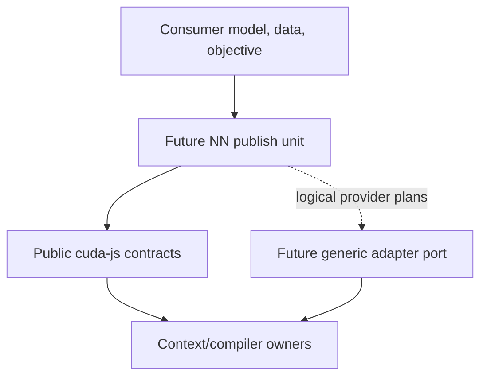

# Optional NN Extension Boundary

**Status:** Informational

**Projection:** Accepted ADR-0004 and SPEC-0027

**Date:** 2026-08-13

## Selected shape

The CUDA-JS repository may eventually publish two independent products. Only the existing generic `cuda-js` core is implemented today. The optional NN product is planned authority: its registry name, repository directory, public API, dependencies, and implementation remain unselected.



Dependency arrows point toward consumed public contracts. Generic core never imports the NN product, and the future NN package cannot deep-import core components or private providers.

## Publication isolation

The future NN product is a separate publish unit in the same repository, not a `cuda-js/nn` subpath. Its eventual package manifest, compatibility identity, dependency graph, release cadence, install/uninstall behavior, and conformance are independently owned. The actual registry name and source directory require later accepted authority; no namespace is presumed.

The current `cuda-js` package remains unchanged:

- no `./nn` or `./nn/*` export;
- no NN or CUDA-library provider dependency;
- no NN source tree in its package contents;
- no provider discovery or initialization during core import;
- no tensor, graph, autodiff, training, or checkpoint semantics in generic actors/components.

## Semantic ownership

The optional product may eventually own application-neutral tensor, staged graph, autodiff, memory-plan, provider-selection, execution-plan, training-state, checkpoint, and NN-conformance contracts. Each boundary requires a separately accepted child specification before production code enters it.

Consumers retain model architecture, datasets, objectives, metrics, domain policy, deployment, and application orchestration. CUDA-MCGS/search semantics remain outside both products.

## Context-bound providers

NN planning can choose a logical provider. Creation/destruction of cuBLAS/cuDNN handles and provider calls over DriverActor-owned device/context/stream/memory/workspace state must execute through a separately accepted generic adapter owned by that resource boundary. The adapter also owns cuBLASLt handle/plan lifetime and invokes it under the required current device and borrowed execution resources. A distinct actor with its own resources would require a separate accepted resource/interop design. NN code may own logical lowering/source semantics, while CompilerActor retains compiler-provider lifecycle, compilation, cache identity, and typed copied PTX/LTO/cubin artifacts.

This rule does not authorize SPEC-0023 or any provider implementation. Exact library ABI, device behavior, numerical correctness, cleanup, and support remain native qualification work.

## Current status and falsifiers

```text
architectural disposition: planned
implementation status:    not-implemented
qualification status:     not-qualified
```

The boundary is falsified if core gains an NN export/dependency, either product deep-imports the other, deleting the future NN unit breaks core packaging/import, a provider handle escapes its declared private context or adapter/runtime owner, or portable mocks are presented as native provider evidence.

See [`ADR-0004`](../decisions/ADR-0004-nn-extension-package-boundary.md), [`SPEC-0027`](../specs/SPEC-0027-nn-extension-foundation.md), and the [authority assessment](../research/2026-08-13-nn-extension-authority-assessment.md).
