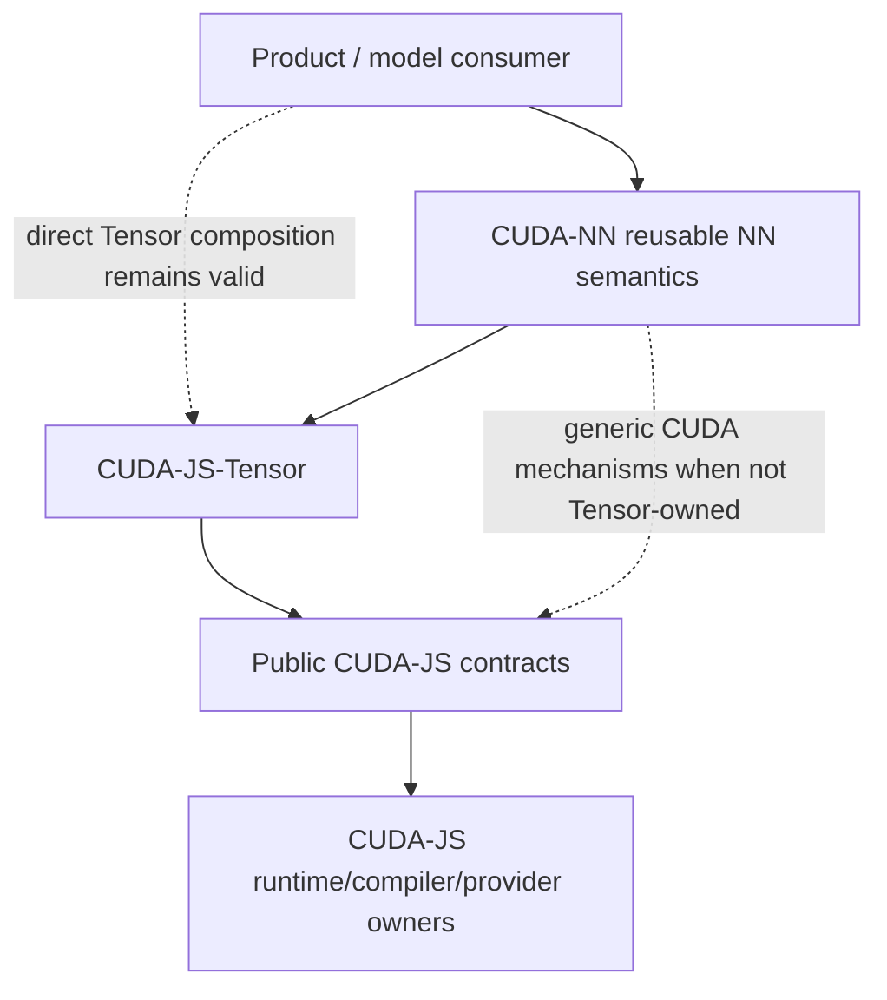

# CUDA-NN Boundary from CUDA-JS

**Status:** Informational

**Current projection:** Accepted ADR-0007

**Historical provenance:** ADR-0004 and SPEC-0027

**Updated:** 2026-09-02

## Selected shape

Reusable neural-network semantics are now owned by the independent [`iteathen/cuda-nn`](https://github.com/iteathen/cuda-nn) repository. CUDA-JS no longer plans a second NN publish unit in this repository.



Dependency arrows point toward consumed public contracts. CUDA-NN and CUDA-JS-Tensor may consume only accepted public CUDA-JS surfaces; CUDA-JS never imports either upper semantic layer.

## Core isolation

The `cuda-js` package remains unchanged in semantic mission:

- no `./nn` or `./nn/*` export;
- no CUDA-NN package/workspace owned by this repository;
- no NN dependency or NN-shaped/eager provider discovery during core import;
- no model, layer, tensor, autodiff, optimizer, training, checkpoint, search, or product semantics in generic runtime/compiler/provider components.

Generic CUDA mechanisms discovered by an upper consumer remain candidates for CUDA-JS only after normal consumer-neutral ownership assessment. The motivating consumer does not become part of the lower-layer contract.

## Semantic ownership

### CUDA-NN

CUDA-NN may own reusable model/layer/NN graph semantics, parameter and NN-state roles, provider-neutral inference composition, NN-specific lowering/provider selection and—when separately accepted—autodiff, gradients, losses, optimizers, training RNG, checkpoints and training lifecycle.

Repository creation does not make those capabilities implemented. CUDA-NN requires its own consumer-backed inference justification gate before production NN source/API is accepted.

### CUDA-JS-Tensor

Generic tensor dtype/shape/layout/view/broadcast/reduction/matmul/gather/concat/convolution/fusion/planning/execution semantics belong to CUDA-JS-Tensor when useful independently of NN meaning.

The historical SPEC-0027 `nn.tensor` allocation is not current ownership authority.

### CUDA-JS

CUDA-JS owns generic CUDA runtime/compiler/Device-JS/memory/views/launch/operation/prepared-execution/synchronization/publication/provider/artifact/resource-lifecycle mechanisms.

### Products and search frameworks

Consumers retain concrete model package/provenance, feature encoding, policy/action mapping, output-head meaning, domain policy, deployment and product semantics. CUDA-MCGS retains graph-search/evaluator/progress/session/search semantics.

## Provider boundary

Provider branding does not determine semantic ownership.

- CUDA-JS owns accepted generic cuBLASLt/cuDNN/NCCL discovery, native handles, bounded operation plans, workspace/admission, execution, native errors and teardown.
- CUDA-JS-Tensor owns generic mathematical Tensor operations and provider eligibility where naturally tensor-level.
- CUDA-NN owns NN semantic eligibility, provider selection, fallback and equivalence.
- downstream products retain product-specific selection/tolerance meaning.

Current lower-layer trackers are CUDA-JS #75 for generic cuBLASLt, #163 for deferred generic cuDNN, and #164 for deferred generic NCCL. Their existence does not authorize provider breadth without accepted bounded child contracts and evidence.

## Historical disposition

ADR-0004 and SPEC-0027 remain immutable historical accepted records documenting the earlier same-repository isolation decision. ADR-0007 supersedes their **repository/product placement** for current work.

For historical validation/provenance, the superseded projection was: **Projection:** Accepted ADR-0004 and SPEC-0027; the NN product was a separate publish unit in the same repository, with implementation status `not-implemented` and qualification status `not-qualified`.

Useful isolation rationale remains valid where it agrees with current owners, but neither historical record authorizes `nn.*` source, package/workspace creation, local Tensor semantics, or a training-first implementation roadmap in CUDA-JS.

## Current status and falsifiers

```text
cuda-nn repository owner: integrated at main@7d7854697049db38e4a0670b80df9d600cd442c3
cuda-nn production API:    not-authorized
cuda-nn implementation:    not-implemented
cuda-nn qualification:     not-qualified
cuda-js NN product:        none
```

The boundary is falsified if:

- CUDA-JS core gains NN/model/training semantics, exports or dependencies;
- CUDA-NN or CUDA-JS-Tensor deep-imports CUDA-JS private source;
- CUDA-NN duplicates generic Tensor mathematics instead of routing it to CUDA-JS-Tensor;
- a generic CUDA-JS provider/primitive requires NN vocabulary or interpretation;
- deleting CUDA-NN breaks CUDA-JS core coherence;
- mocks/portable evidence are presented as native/provider/production proof.

See [`ADR-0007`](../decisions/ADR-0007-extract-cuda-nn-semantic-product.md), historical [`ADR-0004`](../decisions/ADR-0004-nn-extension-package-boundary.md), historical [`SPEC-0027`](../specs/SPEC-0027-nn-extension-foundation.md), and the independent CUDA-NN repository authority.
